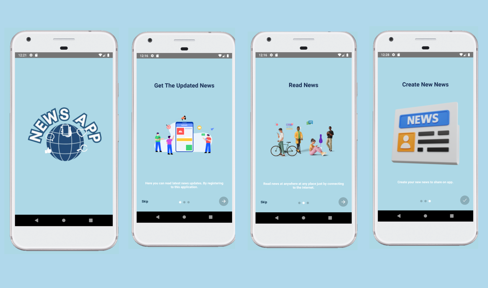
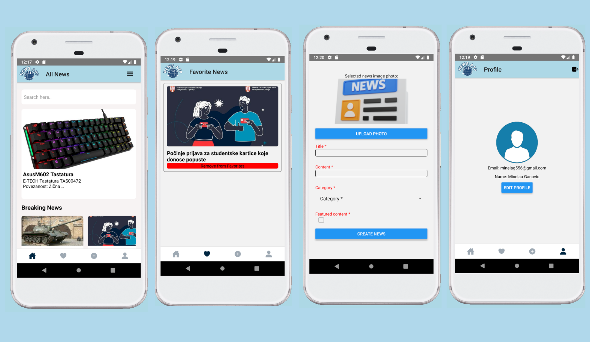

# ___NewsApp___

This is a full stack news application built with React Native and Node JS. 
<a href="https://github.com/minelaganovic/NewsApp_Backend">Link to the backend of the project </a>

# Features
- User-friendly application for all types of people.
- Get all types of news
- Search for all types of news
- Creating a new news
- Liking a specific news
- View and edit your profile
  
# 📱 App Screens

## Splash Screen and Onboarding Screen

## sign-in Screen and sign-up Screen

## The others screens

